# Knowledge Base Construction
## Named Entity Recognition
- 命名实体是具有名称的实体
- 命名实体识别（NER）是在语料库中查找实体名称的任务。
- Dictionary 包含一组实体名称，如果实体在前面已知，则可以使用它。
- Naive Dictionary NER is slow 时间复杂度 O（textLength X dictSize X maxWordLength）
- Trie(字典树)，统计或排序大量的字符串，以空间换时间，公共前缀在相同路径上，若为true，则为一个单词。O(textLength × maxWordLength)

- 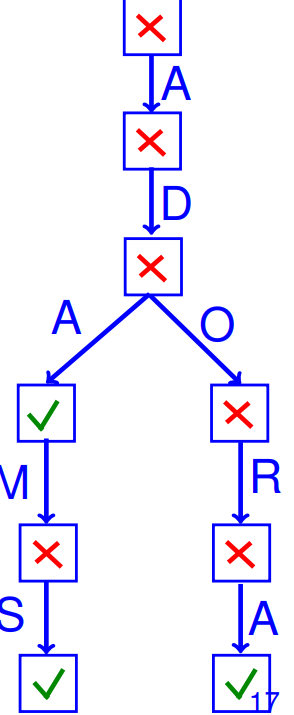
  从上图可以看出
  Adams adores Adora的判断顺序为

  ada ->true
  adams -> true
  adore -> false
  adores -> false
  adora -> true

- Dictionary NER
  - very efficient
  - have to be given upfront,have to be maintened to accommodate new names,cannot deal with name variants, cannot deal with infinite or unknown sets of names
- Language
  - 通过正则的方式来描述，所需要的空间变少
  - 例如:
    -{,ab,abab,ababab}=>(ab)*
    -{1990,1992,1993}=>[0-9]{4}

    He found the answer to life, => the answer to ([a-z]+),
    the universe, and everything => the (([a-z]+) and ([a-z]+))
      - 1st group: life
      - 2nd group: universe and everything
      - 3rd group: universe
      - 4th group: everything

- Evaluation
  - prec = output ∩ standard / output
  - Recall = output ∩ standard / standard
  - F1 = 2 * pre * recall / (pre+recall)
- IE algo
  - 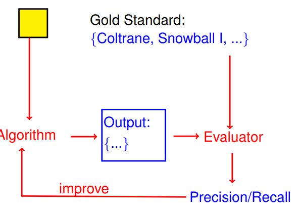
- Disambiguation
  - 鉴于一个语料库中含糊不清的名字及其含义，消除歧义是确定意图的任务。
  - Usually Named Entity Recognition (NER) runs first, and the goal is to map the names to entities in a Knowledge Base (KB)
  - Stopword: Allwords/{nom,adj,非组动词non-auxiliary verbs}
  - Context of a word
  - Context of an entity
  - Context-based disambiguation
  - Disambiguation Prior 通过匹配成功次数+1算分
  - Coherence 相干性，文中的词之间可有相关联系

## NERC Named Entity Recognition and Classification
- NE Recognition & Classification 对里面的单词进行分类
  - the task of (1) finding entity names in a corpus and (2) annotating each name with a class out of a set of given classes.
  - Not EZ
  - Window 在读取句子时，其上下文的范围。 例如 [a,a,a,a,at,b,b,b,b] at为正在读取的，这里size=4
  - NERC Feature
   - 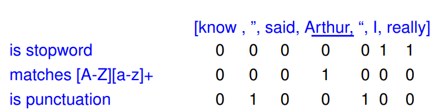
  - Stanford NERC system
   - Paris —> Xxxx
   - M2 D&K —> X# X&X
   - +33 1234 —> +## ####
  - POS
    - Part-of-Speech 词性，adj啊 vt啊  vi啊。。
  - Morphological features
    - -ish, -ist, ... 某一种身份
  - Rule
    - in XXX -> location
    - XX is -> Person
    - Dr, Ms -> Person
  - **Statistical NERC corpus**
    - 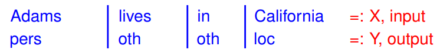
    - f(X,i,y) = 1 if Xi is CapWord 并且y="location" else = 0
    - f1(X, i, y) := 1 if xi−1 is title ∧ y =“pers”
      - f1(<Mr., Arthur>, 1, pers) = 0
      - f1(<Mr., Arthur>, 2, pers) = 1
      - f1(<Mr., Arthur>, 1, loc) = 0
    - 上面的0，1是权值的一种，但是对于某一些feature，其权值不应该为1，所以会乘以W,而这个W要用梯度下降法去得到
      - 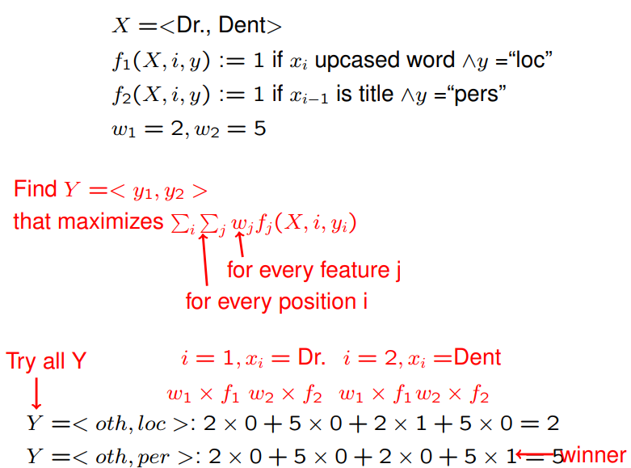

## CRFs 条件随机场
  - https://www.jianshu.com/p/55755fc649b1
  - 
    - 句子s（就是我们要标注词性的句子）
    - i，用来表示句子s中第i个单词
    - l_i，表示要评分的标注序列给第i个单词标注的词性
    - l_i-1，表示要评分的标注序列给第i-1个单词标注的词性
  - 对这个分数进行指数化和标准化，我们就可以得到标注序列l的概率值p(l|s)
    - 
    - 当l_i是“副词”并且第i个单词以“ly”结尾时，我们就让f1 = 1，其他情况f1为0。不难想到，f1特征函数的权重λ1应当是正的。而且λ1越大，表示我们越倾向于采用那些把以“ly”结尾的单词标注为“副词”的标注序列
  - CRF 与 HMM 的比较
    - HMM的思路是用生成办法，就是说，在已知要标注的句子s的情况下，去判断生成标注序列l的概率
    - 
    - p(l_i|l_i-1)是转移概率，比如，l_i-1是介词，l_i是名词，此时的p表示介词后面的词是名词的概率。
    - p(w_i|l_i)表示发射概率（emission probability），比如l_i是名词，w_i是单词“ball”，此时的p表示在是名词的状态下，是单词“ball”的概率。
  - CRF比HMM要强大的多，它可以解决所有HMM能够解决的问题，并且还可以解决许多HMM解决不了的问题。事实上，我们可以对上面的HMM模型取对数，就变成下面这样：
    - 
  - 不难发现，如果我们把第一个HMM式子中的log形式的概率看做是第二个CRF式子中的特征函数的权重的话，我们会发现，CRF和HMM具有相同的形式
  - 每一个HMM模型都等价于某个CRF

## POS-Tagging
  - Probabilistic POS-Tagging
   - 每个单词都有多种词性，给其匹配的概率
   - Markov Assumption 1 取决于他的邻居
    - P(N|P N, V, D) = P(N|D)
   - Markov Assumption 2 取决于他的tag
    - The probability that the 4th word is “song” depends just on the tag of that word:
    - P(song|Elvis, sings, a, P N, V, D, N) = P(song|N)
   - Homogeneity Assumption 1
   - Homogeneity Assumption 2
   - **Hidden Markov Model**
    - https://www.youtube.com/watch?v=4lB5bzJxuMw
    - Viterbi Algorithm
  - Given a sentence and transition and emission probabilities, Probabilistic POS Tagging computes the sequence of tags that has maximal probability (in an HMM).
    - 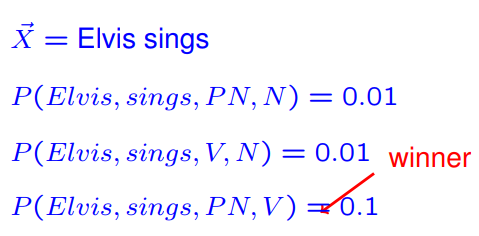

## Instance Extraction
  - Is-A
    - is-a(X,Y), x is an instance or subclass of Y
      - 从句子中提取出这种殷果关系 （such as）
    - Classical Hearst Patterns
      - Y such as X+ X+ is a set of X (I lived in suchcountries as Germany,France, and Bavaria)
      - and, including, especially
    - Taxonomy induction 分类归纳
      - Taxonomy induction is the process of creating an entire taxonomy
        - 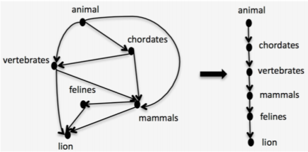
      - steps:
        1. is-a extraction, as seen before
        2. Removal of cycles根据从属关系去掉环
        3. Classify edges as “is-a” or “non-is-a” with
          - frequency counts (in both directions)
          - substring inclusion
          - difference in generality (distance to the root)
    - Set Expansion
      - 给其添加额外的属性，比如说
        - city:{Springfield, Seattle} => cities: {Springfield, Seattle, Washington, Chicago, ...}
      - Recursive Pattern Application
        - 以递归的形式进行扩展
          1. Start with the seeds
          2. Find the pattern "X, Y, and Z" in the corpus. (从中找出句子，包含seeds的，已经另外一个不包含在内的)
          3. If 2 variables match known instance names, add the match of the 3rd.
          4. Go to 2
      - Table Set Expansion
        1.  Start with the seeds
        2.  Find HTML tables where one column contains 2 known instance names
        3.  Add all column entries to the set
        4.  goto 2
      - ex:
        - 

## Fact Extraction
  - Fact Extraction 事实抽取是从语料库中提取有关实体的事实
    - the extraction of facts about entities from a corpus.
    - patterns: X ->  Y    -> is the relation like born in
    - Get patterns:
      - Option 1: Manually compile patterns.
      - Option 2: Manually find the patterns in texts
        - 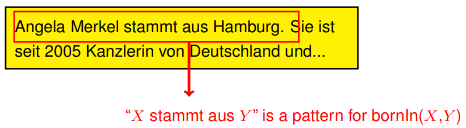
      - Option 3: Pattern deduction
        - 给定一个corpus和一个知识库KB，然后通过corpus去产生一个知识库的事实
        - 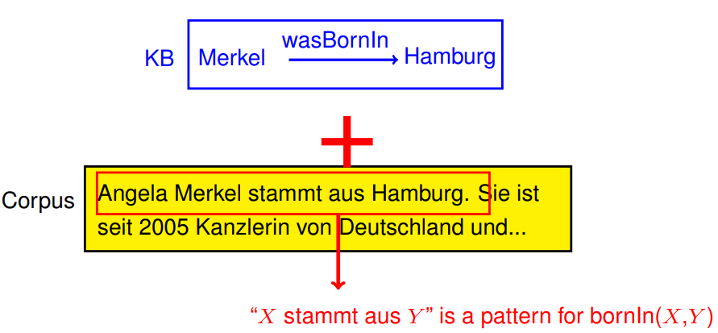
      - Pattern Application
        - Given a corpus, and given a pattern, pattern application is the process of finding the facts produced by the pattern
        - 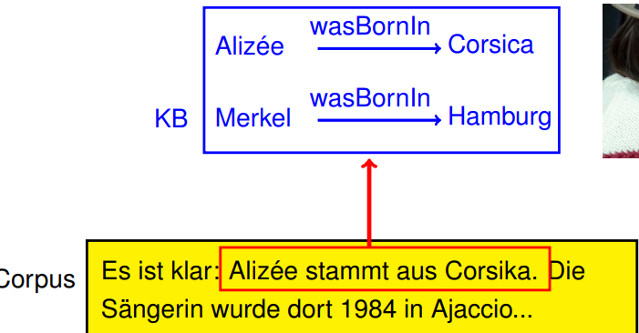
    - Pattern iteration/DIPRE
      - Pattern iteration (also: DIPRE) is the process of repeatedly
        - applying pattern deduction
        - using the patterns to find new facts
        - 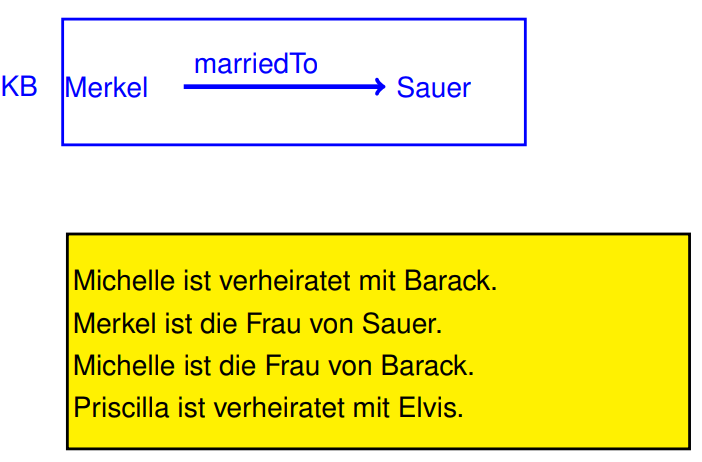
          - => X ist Frau von Y is a pattern for marriedTo(X,Y)
          - => X ist verheriratet mit Y is a pattern for marriedTo(X,Y)
          - => Priscilla marriedTo Elvis
    - Patterns in NELL
      - Never Ending Language Learner
      - Apple (produced) -> Maxbook
  - Summary:
    `
    I love Simpsons such as Bart, Lisa, and Homer.
    Homer is the father of Bart.
    Homer is the father of Lisa.
    `
    - 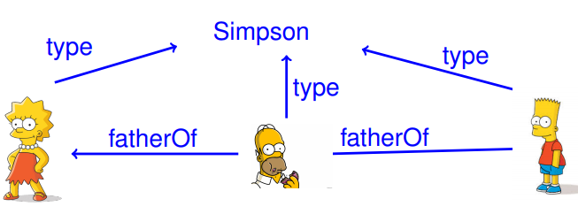

  - Confidence of a pattern
    - Pattern produces mostly new facts => risky
    - Pattern produces mostly known facts => safe

## Information Extraction by Reasoning
  - atom
  - Rules, Disjunctions, Clauses
    - likes(Hermione, Ron) ⇒ likes(Harry, Ron) = ¬likes(Hermione, Ron) ∨ likes(Harry, Ron) = {¬likes(Hermione, Ron), likes(Harry, Ron)}
  - Weighted MAX SAT
    - 找出条件使得满足最高权值
  - Exhaustive search 彻底搜索使得得到MAX SAT
  - Intuition of unit propagation 将重复的单元删除
  - Unit propagation for clauses 根据给出的clause去删除rule和否定的rule

## Markov Logic
  
## Semantic Web in practice
  - RDF
    - is a knowledge representation based on
      - entities
      - classes
      - binary relations
      - labels
  - URIs
    - Namespace / Qualified Name
      - is a named set of (so-called “local”) names
      - KB1, KB2, KB3
    - URI
      - is a string that follows the syntax
      - <scheme name> : <hierarchical part> [ <query> ] [ & <fragment> ]
      - Ex: Priscilla in elvis:
            http://elvis.org/kb/Priscilla
  - Standard Vocabularies
    -

## Decidability
  - Decision problem 是一个yes or no 问题，
  - Undecidable problem 他无论如何也不可能有一个正确的算法来解决
  - Entscheidungsproblem 询问一个真假问题是否可以被回答
  - Turing Machine -> a simplifiedmodel of an algorithm (computer program).
  - FOL is Undecididable problem
  - FOL is semi-decidable
